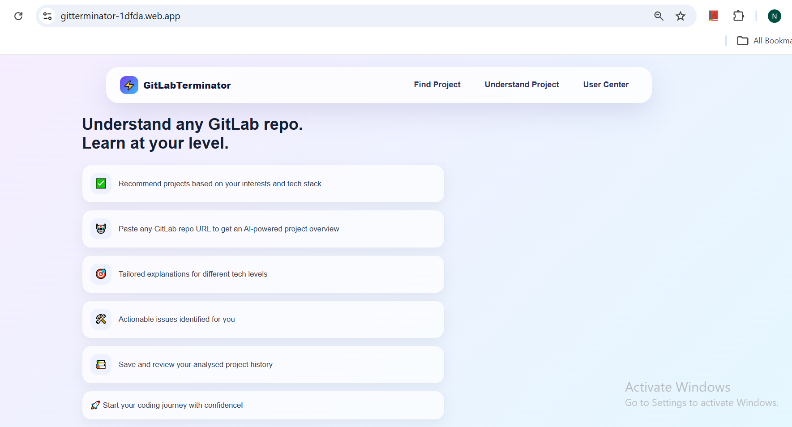
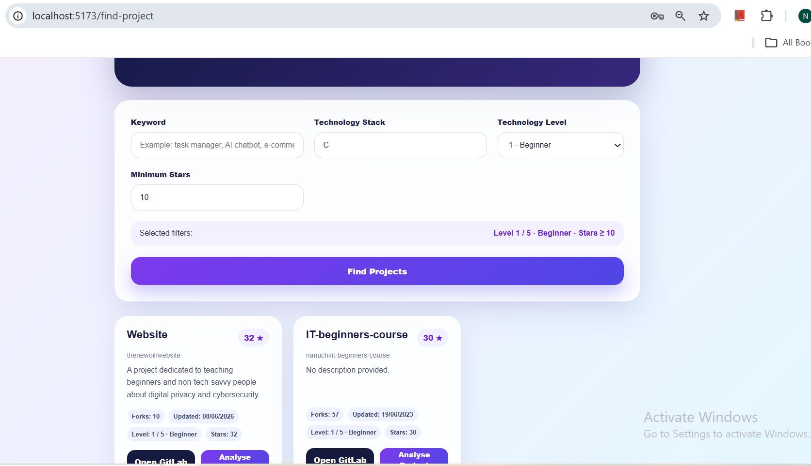
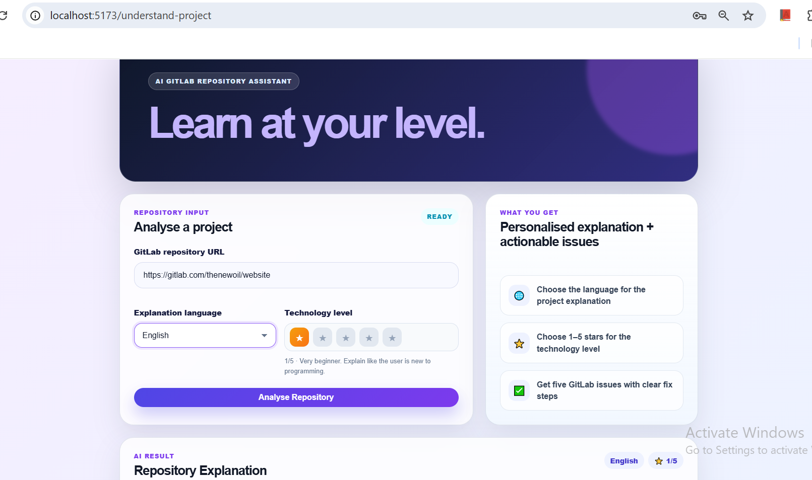
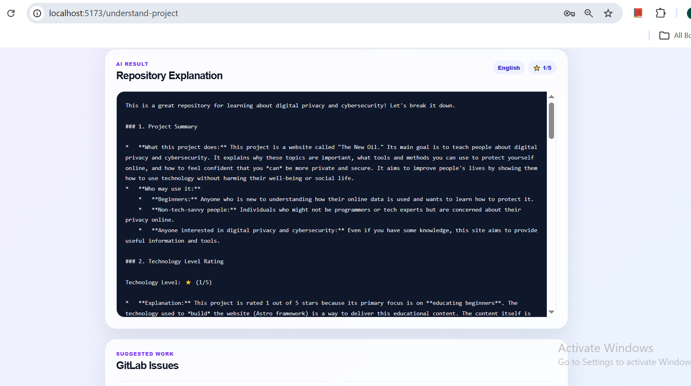
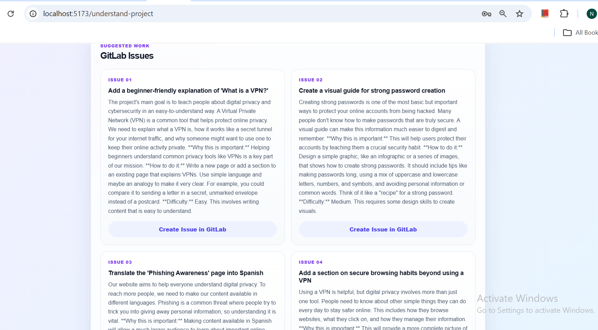
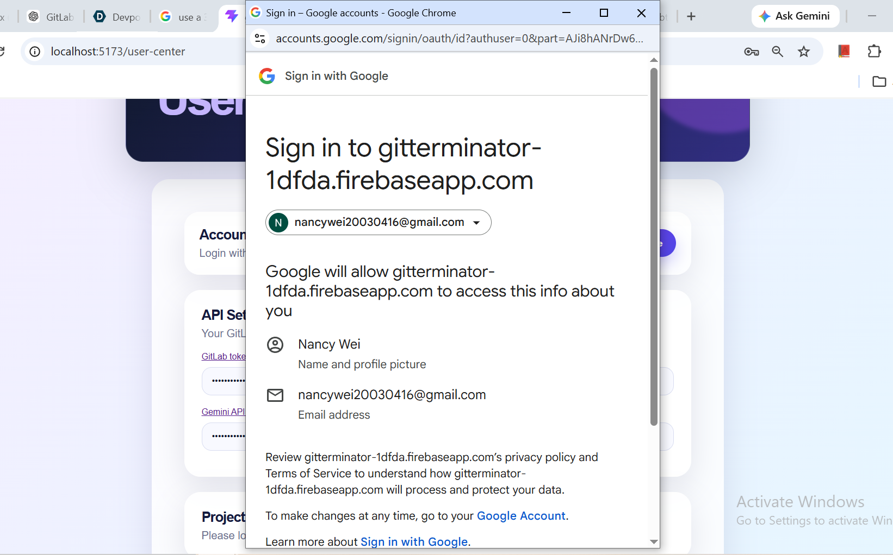
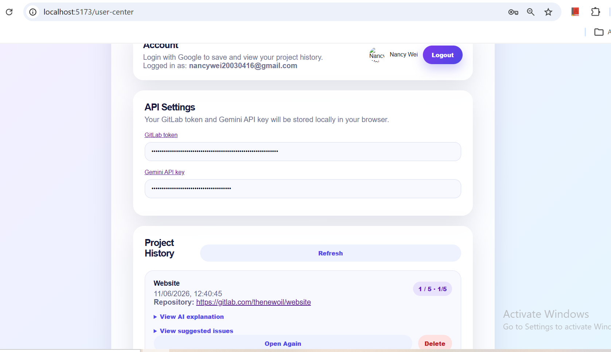

# GitLabTerminator
Understand GitLab projects quickly.
Find suitable beginner-friendly learning projects.
Get AI-suggested issues and fix steps.
## Needed
GitLab repository URL(https://gitlab.com) 
GitLab token([Create GitLab Personal Access Token](https://docs.gitlab.com/user/profile/personal_access_tokens/)) 
Gemini API key([Create Gemini API Key](https://aistudio.google.com/app/apikey)) 
## Image Gallery

### Home Page

### Finding a Project Page

### Analysing Page

### AI Explanation Result

### History Page

### Issue Suggestion

### Google Login Page

